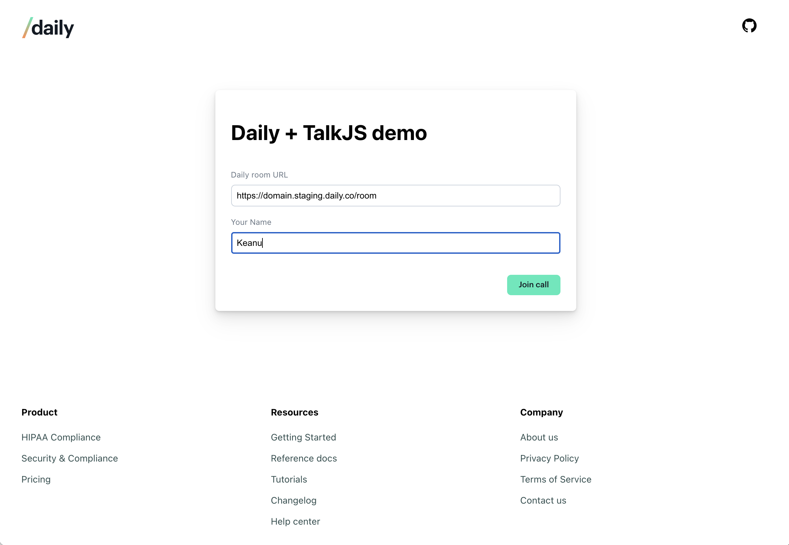
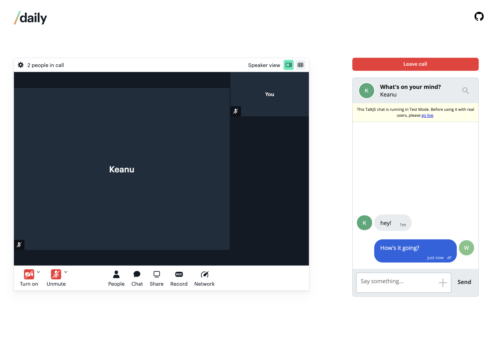

# Daily and TalkJS chat integration demo app

This project demonstrates one way to integrate a [Daily Prebuilt](https://daily.co/prebuilt) call with [TalkJS's Chatbox](https://talkjs.com/docs/Reference/JavaScript_Chat_SDK/Chatbox/) in a group call. Minor changes could accommodate TalkJS's other chat integration options, such as one to one calls. We encourage you to fork and update this repo however you see fit!



## Running this demo locally

In the project directory, you can run:

```bash
yarn
yarn start
```

Open http://localhost:3000 to view it in the browser.

## Setting your local environment variables

Before starting the server, create an `.env` file with the following values:

```
REACT_APP_TALK_JS_APP_ID="your-app-id"
REACT_APP_DAILY_API_KEY="your-daily-api-key"
```

You can also copy the `.env.sample` file provided in the root directory.

---

## Setting up Daily and TalkJS accounts

To use this demo, you will need a Daily and a TalkJS account. Both offer free account options.

### Getting set up with Daily

To start, [create a Daily account](https://dashboard.daily.co/signup).

Once you have an account and are logged into the [Daily Dashboard](https://dashboard.daily.co), you can [create a new Daily room](https://dashboard.daily.co/rooms/create).

Copy the new room's URL. You can use this room for this demo.

The room URL will be in the following format:

`https://<your-daily-domain>.daily.co/<room-name>`

### Getting set up with TalkJS

Start by setting up a [TalkJS account](https://talkjs.com/dashboard/login).

You will need two pieces of information for this demo:

- the Test App ID, available in the TalkJS dashboard (string)
- a role type, which can be created from the TalkJS dashboard (string)
  - set this new role type to "participant" or, if you use a different role type, update the `role` value in `Chat.jsx`


