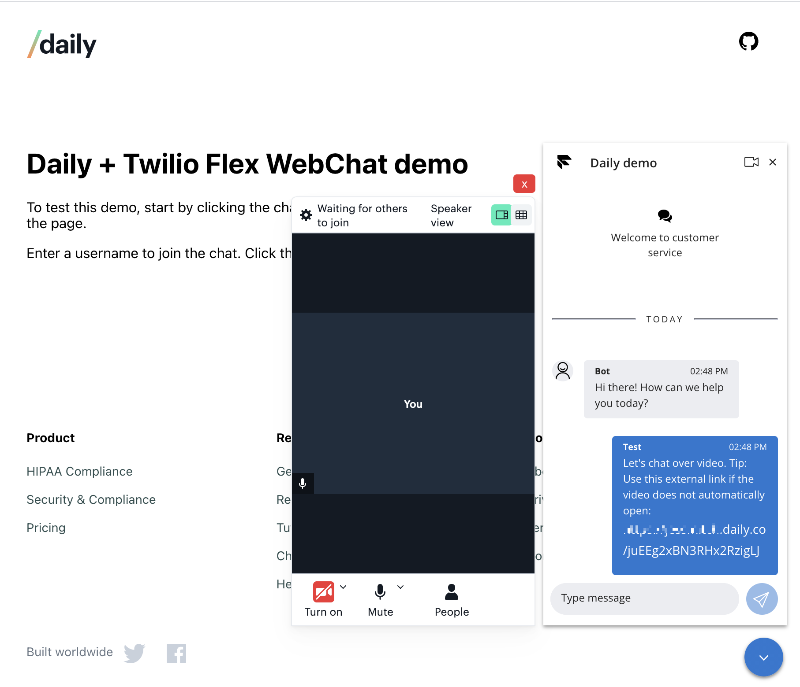

# Daily Demo: Twilio Flex Webchat integration

This project demonstrates one way to integrate a [Daily Prebuilt](https://daily.co/prebuilt) call with [Twilio's Flex Webchat UI](https://www.twilio.com/docs/flex/developer/webchat/setup).

The intention is to extend Twilio's web chat widget by adding the option to add a video call with the chat's moderator.



## Running this demo locally

In the project directory, you can run:

```bash
yarn
yarn start
```

Open http://localhost:3000 to view it in the browser.

## Setting your local environment variables

Before starting your server, create an `.env` file with the following values:

```
REACT_APP_TWILIO_ACCOUNT_SID="your-account-sid"
REACT_APP_TWILIO_FLEX_FLOW_SID="your-flex-flow-sid"
REACT_APP_DAILY_API_KEY="your-daily-api-key"
```

You can also copy the `.env.sample` file provided in the root directory.

To find these values, follow the directions below.

---

## Setting up Daily and Twilio accounts

To use this demo, you will need a Daily and a Twilio account. Both offer free account options.

### Getting set up with Daily

To start, [create a Daily account](https://dashboard.daily.co/signup).

Once you have an account and are logged into the [Daily Dashboard](https://dashboard.daily.co), you can find your API key on the [Developers page](https://dashboard.daily.co/developers).

### Getting set up with Twilio

Start by setting up a [Twilio account](https://www.twilio.com/try-twilio).

You will need two pieces of information for this demo:

- the Account SID, available in the [console homepage](https://console.twilio.com/?frameUrl=%2Fconsole%3Fx-target-region%3Dus1)
- the Flex Flow SID, available in the [Flex console](https://flex.twilio.com/admin/developers)

To view the messages sent through this demo, visit Twilio's [agent desktop](https://flex.twilio.com/agent-desktop/).
